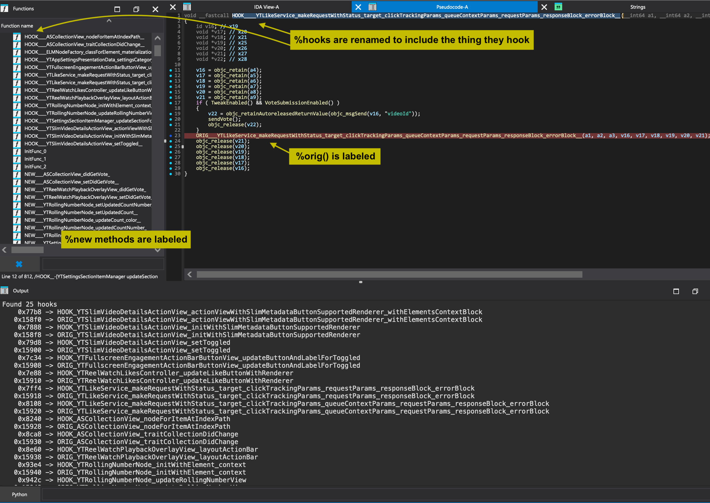

## TweakInspect

A tool for reverse engineering iOS tweaks. TweakInspect provides both a CLI and Python API to analyze hooked APIs, and integrates with disassemblers (IDA Pro and Hopper) to automatically label hooks, new methods, and `%orig` calls.

## Features

### Core Functionality
* Instantly analyze hooked APIs in iOS tweaks
    * Works with tweaks and other arm64 mach-o binaries
    * Supports theos/logos syntax (`%hookf`, `%hook`, `%new`, `%orig`)
    * Compatible with common hooking libraries and Objective-C swizzling

### Multiple Interfaces
* Command-line interface
    * Quick analysis of hooks in binaries
    * Automatic extraction from `.deb` packages
* Python API for tool integration and automation
* Disassembler integration
    * IDA Pro and Hopper support
    * Automatic labeling of:
        * Hooked functions
        * New method implementations
        * `%orig` calls

## Usage

### CLI

```bash
# Analyze hooks in a tweak
python main.py CarPlayEnable.dylib
```

```objective-c
%hookf BKSDisplayServicesSetScreenBlanked() @ 0x934c. replacement @ 0x9200

%hook -[CARAppDockViewController _updateNowPlayingBundleIdentifier:] @ 0x12818, replacement @ 0x13884
%hook -[CARAppDockViewController _dockButtonPressed:] @ 0x12838, replacement @ 0x13a80

%new -[CARApplication CB_ReceivedSettingsUpdatedNotification] @ 0x12598, replacement @ 0x12c24
%new -[CARApplication CB_updateApplicationLibrary:] @ 0x125c4, replacement @ 0x12cd8
%hook -[CARApplication init] @ 0x12550, replacement @ 0x12b20
%hook -[CARApplication _newApplicationLibrary] @ 0x12570, replacement @ 0x12bb4
```

### Python API

```python
compiled_binary = Path("tweak.dylib")
print(Executable(file_path=compiled_binary).get_hooks())

# Output
[{
  "type": "Hook",
  "target": {
    "type": "NewObjectiveCMethodTarget",
    "class_name": "SpringBoard",
    "method_name": "CBPressHomeButton"
  },
  "replacement_address": 62988,
  "original_address": 0,
  "callsite_address": 62008
},
{
  "type": "Hook",
  "target": {
    "type": "ObjectiveCTarget",
    "class_name": "SpringBoard",
    "method_name": "applicationDidFinishLaunching:"
  },
  "replacement_address": 62096,
  "original_address": 176608,
  "callsite_address": 61904
}, ...]
```

### IDA Pro




### Hopper Disassembler


